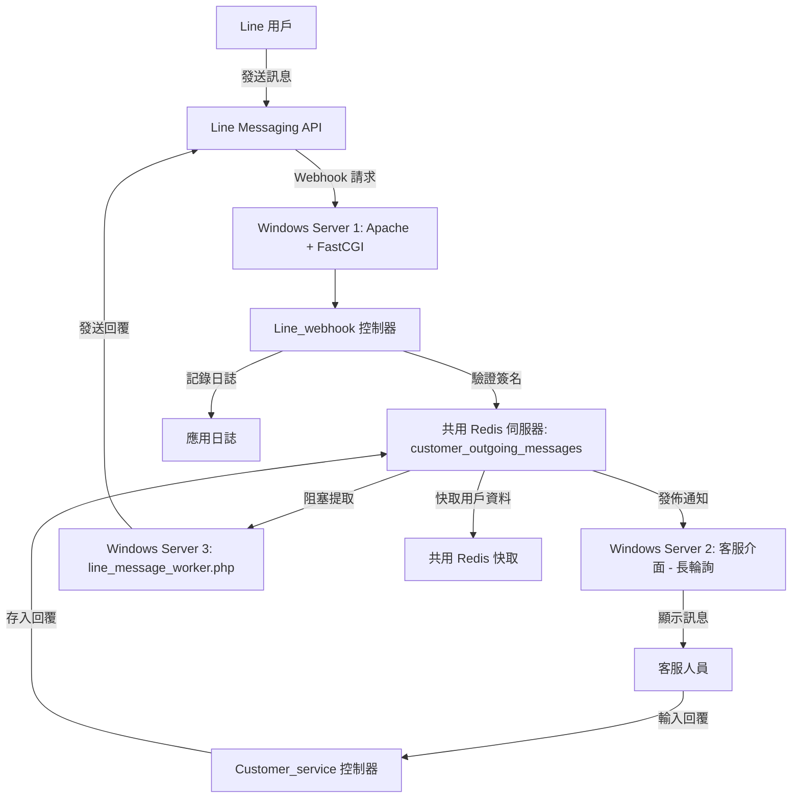

# LineLiveChat_CI

這是一個基於 **CodeIgniter 3.1.13** 打造的 Line 客服系統，結合 **Line Messaging API** 和 **Redis**，讓客服人員可以即時處理 Line 用戶的訊息。系統使用**長輪詢**技術實現客服介面的即時訊息更新，並透過後台 Worker 非同步發送回覆。專案經過優化，可穩定支援 **100~200 人同時在線**，特別透過在不同 Windows Server 上共用 Redis 解決效能瓶頸，適合中小型企業的客服需求。原始碼位於 [GitHub 倉庫](https://github.com/BpsEason/LineLiveChat_CI.git)，非常適合用來展示 PHP 應用開發能力，放入作品集或面試展示皆宜。

## 系統亮點
- **跨 Windows Server 共用 Redis**：透過在多台 Windows Server 上部署並共用單一 Redis 實例，實現訊息佇列和快取的高效共享，顯著提升高併發場景下的效能，解決單伺服器記憶體和處理瓶頸，穩定支援 **100~200 人同時在線**。
- **高併發處理**：結合 Redis 佇列和長輪詢技術，確保高效訊息處理與低延遲回應，特別適合分散式環境下的高流量需求。
- **高效訊息佇列**：使用 Redis 的 `LPUSH`/`BLPOP` 實現高併發訊息接收與回覆，解耦 Webhook 和客服處理，確保穩定性。
- **即時客服體驗**：透過 jQuery 長輪詢，客服介面能即時顯示新訊息，無需頻繁請求伺服器，兼顧效率與簡易實現。
- **非同步回覆**：後台 Worker 獨立處理回覆發送，減輕 Web 伺服器負擔，適合高流量場景。
- **安全設計**：支援 Line Webhook 簽名驗證（HMAC-SHA256）和 CodeIgniter CSRF 保護，確保請求來源安全與防止惡意操作。
- **輕量架構**：採用 CodeIgniter 3，快速部署、易於維護，適合中小型專案或快速原型開發。

## 功能
- 接收 Line 用戶的文字、貼圖、圖片訊息，以及追蹤/取消追蹤事件。
- 客服介面即時顯示新訊息（透過長輪詢）。
- 用 Redis 佇列管理訊息，解耦接收和回覆的處理。
- 後台 Worker (`line_message_worker.php`) 負責從 Redis 取出客服回覆並發送。
- 支援 Line Webhook 簽名驗證，確保安全性。
- 使用 CodeIgniter 的 CSRF 保護，避免未授權請求。

## 架構流程圖
以下是系統的架構流程圖，使用 Mermaid 語法繪製，展示各組件（包括跨 Windows Server 共用 Redis）的交互流程：



**說明**：
- **Line 用戶** 透過 Line 發送訊息至 **Line Messaging API**。
- **Webhook** 將訊息轉發至 **Windows Server 1** 上的 **Line_webhook 控制器**。
- 控制器驗證簽名後，將訊息存入 **共用 Redis 伺服器** 的 `line_incoming_messages` 佇列。
- **Windows Server 2** 的 **客服介面** 透過長輪詢從共用 Redis 提取訊息並顯示。
- 客服人員輸入回覆，經 **Customer_service 控制器** 存入共用 Redis 的 `customer_outgoing_messages` 佇列。
- **Windows Server 3** 的 **後台 Worker** 從共用 Redis 提取回覆並透過 Line API 發送。
- 共用 Redis 同時用於快取用戶資料，減少 API 請求，跨伺服器共享確保高效能。

## 專案結構
```
LineLiveChat_CI/
├── application/
│   ├── config/                # 設定檔 (database.php, line.php, redis.php 等)
│   ├── controllers/           # 控制器 (Line_webhook.php, Customer_service.php)
│   ├── libraries/             # 自訂函式庫 (Line_api.php, Redis_library.php)
│   ├── models/                # 模型 (Message_model.php, User_model.php)
│   ├── views/                 # 視圖 (customer_service/index.php 等)
│   ├── cli/                   # CLI 腳本 (line_message_worker.php)
│   └── third_party/           # 第三方庫占位
├── public/
│   ├── css/                   # 樣式 (style.css)
│   ├── js/                    # JavaScript (customer_service.js)
│   └── index.php              # CodeIgniter 入口
├── system/                    # CodeIgniter 核心
├── vendor/                    # Composer 依賴
├── composer.json              # Composer 設定
└── .gitignore                 # Git 忽略設定
```

### 用到的技術
- **CodeIgniter 3.1.13**：簡單好用的 PHP 框架，適合快速開發。
- **Line Messaging API**：透過 `linecorp/line-bot-sdk` 處理 Line 訊息。
- **Redis (Predis)**：跨 Windows Server 共用 Redis 實例，用於訊息佇列 (`line_incoming_messages`, `customer_outgoing_messages`) 和快取。
- **jQuery 長輪詢**：讓客服介面即時更新訊息。
- **CLI Worker**：處理非同步回覆，減輕 Webhook 負擔。
- **Apache + FastCGI**：高效處理 PHP 請求，支援高併發。

## 安裝步驟
1. **克隆專案**：
   ```bash
   git clone https://github.com/BpsEason/LineLiveChat_CI.git
   cd LineLiveChat_CI
   ```

2. **安裝依賴**：
   - 確保 PHP >= 5.6 已安裝。
   - 用 Composer 安裝依賴：
     ```bash
     composer install
     ```
   - 在獨立 Windows Server 或共用伺服器上安裝並啟動 Redis（預設 `127.0.0.1:6379`，或按部署方式另行設定）。

3. **設定 Line API**：
   - 編輯 `application/config/line.php`，填入 Line Channel Access Token 和 Secret：
     ```php
     $config['line_channel_access_token'] = '您的_TOKEN';
     $config['line_channel_secret'] = '您的_SECRET';
     ```

4. **設定 Redis**：
   - 編輯 `application/config/redis.php`，指向共用 Redis 伺服器：
     ```php
     $config['redis_host'] = 'redis-server-ip'; // 例：192.168.1.100
     $config['redis_port'] = 6379;
     $config['redis_password'] = '您的密碼';
     ```

5. **設定資料庫（可選）**：
   - 編輯 `application/config/database.php`，若需要可設定 MySQL 連線（目前為占位）。

6. **設定 Apache Web 伺服器（Windows Server）**：
   - 在 Windows Server 上安裝 Apache 和 PHP，確保 Document Root 設為 `public/`。
   - 確保 `application/` 和 `system/` 目錄無法直接訪問。
   - 強烈建議啟用 HTTPS 保護通訊（使用 SSL 證書）。

7. **啟動 Worker**：
   - 在另一台 Windows Server 上運行 CLI 腳本處理回覆：
     ```bash
     php application/cli/line_message_worker.php
     ```
   - 建議使用 Windows 排程器或第三方工具（如 NSSM）管理 Worker，確保穩定運行。

8. **設定 Line Webhook**：
   - 在 Line Developers 後台設定 Webhook URL，例如：`https://your-domain.com/line_webhook`。

9. **訪問介面**：
   - 瀏覽器輸入 `https://your-domain.com/customer_service` 開啟客服介面。

## 部署與效能優化
為了穩定支援 **100~200 人同時在線**，本專案在多台 Windows Server 上部署，並透過共用 Redis 實例解決效能瓶頸。以下是具體部署方式：

### 1. Apache + FastCGI 部署（Windows Server）
- **環境**：在 Windows Server 上部署 Apache 搭配 FastCGI 模組和 PHP-FPM，支援高併發。
- **配置**：
  - 安裝 Apache 和 PHP（透過 XAMPP 或手動安裝）。
  - 設定 Apache 虛擬主機，指向 `public/` 目錄，範例配置（`httpd-vhosts.conf`）：
    ```apache
    <VirtualHost *:443>
        ServerName your-domain.com
        DocumentRoot "C:/path/to/LineLiveChat_CI/public"

        <Directory "C:/path/to/LineLiveChat_CI/public">
            Options -Indexes +FollowSymLinks
            AllowOverride All
            Require all granted
        </Directory>

        <FilesMatch \.php$>
            SetHandler "proxy:fcgi://127.0.0.1:9000"
        </FilesMatch>

        <Directory "C:/path/to/LineLiveChat_CI/(application|system|vendor)">
            Require all denied
        </Directory>

        SSLEngine on
        SSLCertificateFile "C:/path/to/your-cert.pem"
        SSLCertificateKeyFile "C:/path/to/your-key.pem"
    </VirtualHost>
    ```
  - 啟用 HTTPS，使用 Let’s Encrypt 或自簽證書。
  - 調整 PHP-FPM 設定（`php-fpm.conf`），支援高併發：
    ```ini
    pm = dynamic
    pm.max_children = 50
    pm.start_servers = 10
    pm.min_spare_servers = 5
    pm.max_spare_servers = 20
    pm.max_requests = 500
    ```
- **效能優化**：
  - 啟用 Apache 的 `mod_expires` 快取靜態資源：
    ```apache
    <IfModule mod_expires.c>
        ExpiresActive On
        ExpiresByType text/css "access plus 1 month"
        ExpiresByType application/javascript "access plus 1 month"
    </IfModule>
    ```
  - 使用壓力測試工具（如 JMeter）測試負載：
    ```bash
    jmeter -n -t testplan.jmx -l results.jtl
    ```

### 2. 共用 Redis 部署（跨 Windows Server）
- **環境**：在獨立 Windows Server 上部署 Redis，供多台伺服器（Web Server、Worker）共用，建議配置至少 4GB 記憶體。
- **配置**：
  - 在 Windows Server 上安裝 Redis（使用官方 Windows 版本或 WSL）：
    - 下載 Redis for Windows 或使用 Microsoft 提供的 Redis 移植版。
    - 啟動 Redis 服務：
      ```cmd
      redis-server.exe redis.conf
      ```
  - 修改 Redis 配置文件（`redis.conf`）：
    ```conf
    bind 0.0.0.0 # 允許外部連線
    requirepass 您的強密碼 # 設定密碼
    maxmemory 2gb # 限制記憶體使用
    maxmemory-policy allkeys-lru # 記憶體滿時移除不常用鍵
    appendonly yes # 啟用 AOF 持久化
    appendfsync everysec
    ```
  - 設定 Windows 防火牆，僅允許指定伺服器連線至 Redis 埠（6379）：
    ```powershell
    New-NetFirewallRule -Name "Allow-Redis" -DisplayName "Allow Redis" -Direction Inbound -Protocol TCP -LocalPort 6379 -Action Allow -RemoteAddress <web-server-ip>,<worker-server-ip>
    ```
  - 更新所有伺服器的 `application/config/redis.php`，指向共用 Redis：
    ```php
    $config['redis_host'] = 'redis-server-ip'; // 例：192.168.1.100
    $config['redis_password'] = '您的密碼';
    ```
- **效能優化**：
  - **共用 Redis 的優勢**：多台 Windows Server 共用單一 Redis 實例，集中管理訊息佇列和快取，減少記憶體碎片化，降低單伺服器負載，提升 100~200 人同時在線的處理能力。
  - 監控 Redis 效能：
    ```cmd
    redis-cli INFO MEMORY
    redis-cli LLEN line_incoming_messages
    ```
  - 若佇列過長，可增加 Worker 數量或調整 Redis maxmemory。
- **高可用性**：部署 Redis Sentinel 或 Cluster，實現主從複製與故障轉移：
  ```cmd
  redis-server.exe sentinel.conf --sentinel
  ```

### 3. Worker 部署（Windows Server）
- **環境**：在獨立 Windows Server 上運行 Worker，降低 Web Server 負載。
- **配置**：
  - 使用 NSSM（Non-Sucking Service Manager）將 Worker 設為 Windows 服務：
    ```cmd
    nssm install LineWorker "C:\path\to\php.exe" "C:\path\to\LineLiveChat_CI\application\cli\line_message_worker.php"
    nssm start LineWorker
    ```
  - 檢查 Worker 日誌：
    ```cmd
    type application\logs\log-*.php
    ```
- **連線共用 Redis**：確保 Worker 的 `application/config/redis.php` 指向共用 Redis 伺服器。

### 4. 效能與監控
- **Web Server**：使用 JMeter 或 Apache Benchmark 測試負載：
  ```bash
  ab -n 1000 -c 200 https://your-domain.com/customer_service
  ```
- **Redis**：監控共用 Redis 的連線數與佇列長度：
  ```cmd
  redis-cli MONITOR
  redis-cli INFO CLIENTS
  ```
- **
